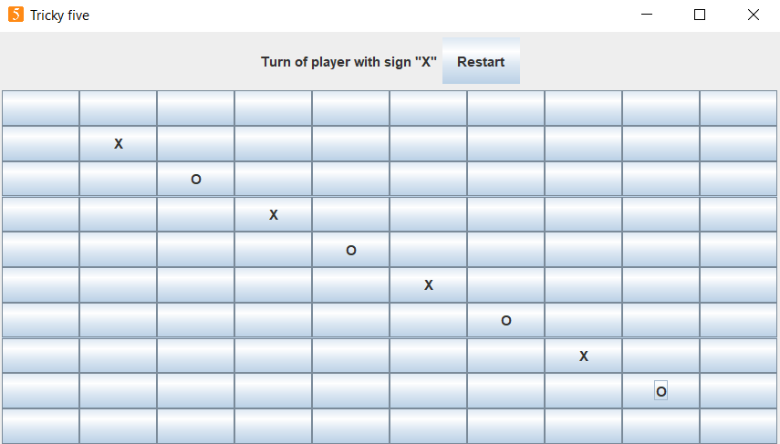
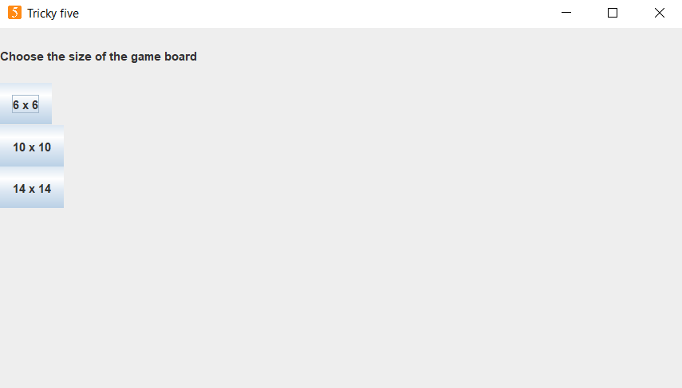

# Tricky five
The game is a variant of the five-in-a-row game. Two players put their signs alternately (X and O) on the free fields of the board. The game ends, when the board is full, or player has won by having five adjacent signs in a row, column or diagonal.
If a player makes 3 adjacent signs, then one of his signs on the board is removed randomly. When the player makes 4 adjacent signs, two of his signs are removed.
### Game was built using Java. It has Java Swing based GUI.
### The documentation is provided in the "tricky_five_documentation.pdf" file.

